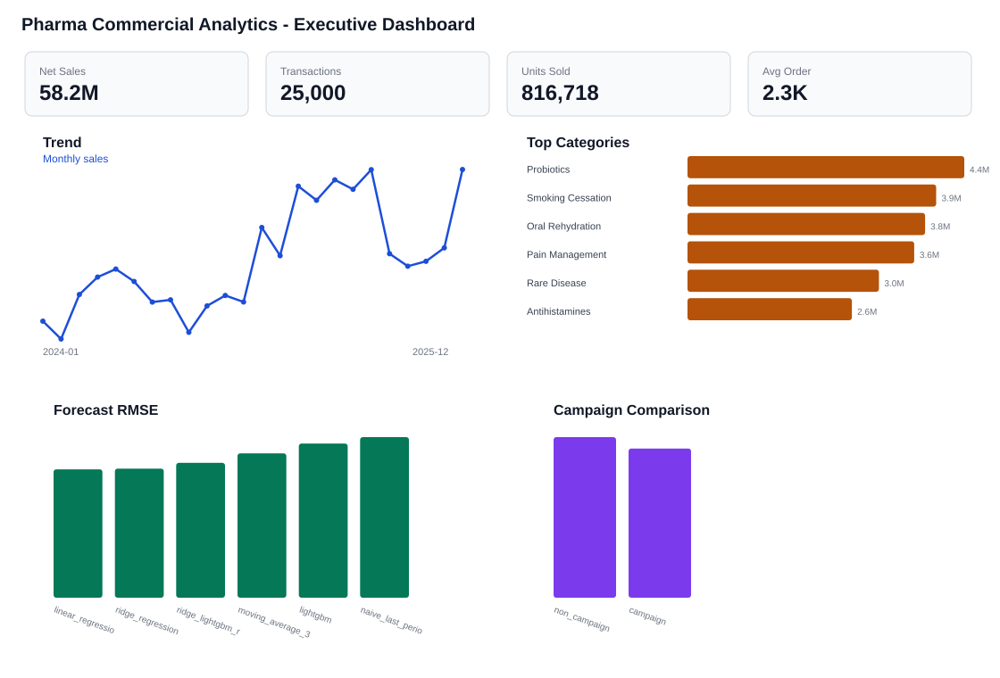

# Pharma Commercial Analytics

Business-facing analytics project for pharma transaction-style data. The workflow covers data cleaning, SQL-style KPI analysis, forecasting, segmentation, A/B-style comparison, and dashboard reporting.

> Status: rebuilt public version. The original project files were unavailable, so this repository uses synthetic sample data to demonstrate the documented workflow safely.

## What This Project Shows

- Transaction-level data cleaning and validation.
- SQL-style commercial KPI analysis.
- Forecasting with naive, moving-average, linear regression, and ridge regression baselines.
- Category segmentation using K-means clustering.
- A/B-style campaign comparison with clear non-causal limitations.
- Dashboard-style screenshots for business stakeholders.

## Dashboard Preview



## Why Synthetic Data Is Used

The portfolio version of this project referred to `600K+` pharma transactions across `57` drug categories. The original raw files are not included in this rebuilt public repository. To keep the project reproducible without exposing private data, this repo generates synthetic transaction-style sample data with the same kind of schema.

Do not interpret the generated sample outputs as real pharma business outcomes.

## Repository Structure

```text
Pharma-Commercial-Analytics/
  index.html             GitHub Pages project website
  assets/                Website CSS and JS
  data/                  Sample data notes and generated CSVs
  dashboards/            Generated dashboard-style screenshots
  docs/                  Data dictionary, methodology, limitations, learning guide
  notebooks/             Lightweight notebook entry points
  outputs/               Generated tables and figures
  reports/               Generated markdown reports
  sql/                   Schema and business queries
  src/                   Reproducible Python pipeline
```

## Project Website

This repo includes a GitHub Pages-ready case study site at `index.html`.

After pushing the repository, enable GitHub Pages from the `main` branch and `/root` folder. See `GITHUB_PAGES.md`.

## How To Run

```powershell
python -m venv .venv
.\.venv\Scripts\Activate.ps1
pip install -r requirements.txt
python -m src.run_pipeline --rows 25000 --force
```

The run creates:

- `data/sample/pharma_transactions_sample.csv`
- `data/sample/pharma_transactions_clean.csv`
- `outputs/tables/forecast_model_metrics.csv`
- `outputs/tables/category_segments.csv`
- `outputs/tables/ab_style_inference.csv`
- `outputs/figures/*.svg`
- `dashboards/screenshots/executive_dashboard.svg`
- `reports/final_report.md`

## Main Methods

| Task | Method Used | Why |
|---|---|---|
| Data cleaning | pandas validation and derived features | Flexible and readable for tabular data |
| KPI analysis | SQL + pandas aggregations | Mirrors business analytics workflows |
| Forecasting | naive, moving average, linear regression, ridge regression | Interpretable baselines with leakage-aware time split |
| Segmentation | K-means clustering | Simple, explainable grouping for commercial categories |
| A/B-style analysis | group comparison + bootstrap CI | Quantifies differences without pretending causal proof |
| Dashboarding | dependency-light SVG dashboard figures | Makes outputs visible in a public repo |

Note: the current rebuilt version generates SVG dashboard-style figures directly from Python, so the project does not require heavy plotting dependencies.

## Current Sample Run

The checked-in sample run was generated with:

```powershell
python -m src.run_pipeline --rows 25000 --force
```

Summary:

| Output | Value |
|---|---|
| Generated sample rows | 25,000 |
| Drug categories | 57 |
| Regions | 5 |
| Channels | 5 |
| Date range | 2024-01-01 to 2025-12-31 |
| Best forecast model in sample run | Ridge regression |
| Best RMSE in sample run | 8,538.73 |

Key generated files:

- `reports/final_report.md`
- `reports/forecasting_results.md`
- `reports/segment_profiles.md`
- `reports/ab_style_analysis.md`
- `outputs/tables/forecast_model_metrics.csv`
- `outputs/tables/segment_profiles.csv`
- `dashboards/screenshots/executive_dashboard.svg`

## Learning Guide

For step-by-step explanation of what is used, why it is used, and what alternatives exist, read:

- `docs/LEARNING_GUIDE.md`
- `docs/METHODOLOGY.md`
- `docs/LIMITATIONS.md`
- `docs/INTERVIEW_GUIDE.md`

## Safe CV Summary

Built a pharma commercial analytics workflow over transaction-style sales data, covering data cleaning, forecasting, segmentation, A/B-style comparison, and dashboard reporting using Python, SQL, regression, K-means clustering, and Tableau/Power BI-style outputs.

## Important Limitations

- Public sample data is synthetic.
- Campaign comparison is not causal inference.
- No clinical, patient-level, or drug efficacy claims are made.
- This is a commercial analytics project, not a medical AI system.
